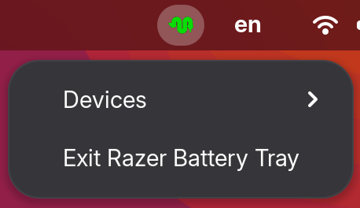
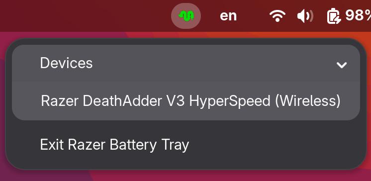
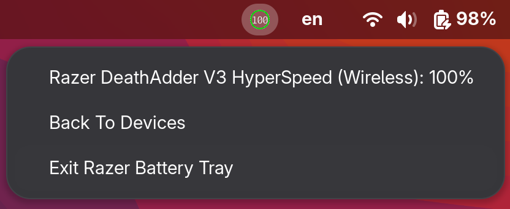

# RazerBatteryTray

Linux system tray application that displays the battery level of your Razer devices, powered by the [OpenRazer](https://openrazer.github.io/) daemon.
Go variant of [RazerBatteryTray](https://github.com/HoroTW/RazerBatteryTray).

 

<table>
  <tr>
    <td align="center"></td>
    <td align="center"></td>
  </tr>
  <tr>
    <td align="center"><b>Main Menu</b></td>
    <td align="center"><b>Main Menu Expanded</b></td>
  </tr>
  <tr>
    <td colspan="2" align="center"></td>
  </tr>
  <tr>
    <td colspan="2" align="center"><b>Device Menu</b></td>
  </tr>
</table>

## Features

- LightWeight - Low memory footprint(~4-10MB)
- AutoConnect - if only one device is detected, the tray app automatically connects to it without requiring manual selection.
- Device picker - Switch between multiple Razer devices.
- Color-coded levels:
  - Green - normal (20% - 100%)
  - Amber - low (10% - 20%)
  - Red - critical (0% - 10%)
  - Teal - charging

## Requirements

- Linux with a system tray host (e.g. GNOME with AppIndicator support, KDE Plasma)
- [OpenRazer](https://openrazer.github.io/) correctly installed
- Go 1.22+ (only needed to build)

Verify the daemon is reachable:

```bash
busctl --user list | grep org.razer
```

## Build & Run

```bash
go build -o razerbatterytray .
./razerbatterytray
```

The binary targets Linux by default; cross-compile explicitly with:

```bash
GOOS=linux GOARCH=amd64 go build -o razerbatterytray .
```

```bash
chmod +x razerbatterytray
./razerbatterytray
```

### Autostart with systemd

To start the tray automatically at login, create a **user** service at `~/.config/systemd/user/razerbatterytray.service`:

```ini
[Unit]
Description=Razer Battery Tray
PartOf=graphical-session.target
After=graphical-session.target

[Service]
ExecStart=<ExecFilePath>
Restart=on-failure
RestartSec=5

[Install]
WantedBy=graphical-session.target
```

Adjust `ExecStart` to wherever you placed the binary.
Then enable it:

```bash
systemctl --user daemon-reload
systemctl --user enable --now razerbatterytray.service
```

Check status and logs:

```bash
systemctl --user status razerbatterytray.service
journalctl --user -u razerbatterytray -f
```

## Contribution

Since this has only been tested on my own Razer device, im sure there are things to add/fix. Any type of feedback is welcome! open an Issue or submit a Pull Request.

## License And Stuff

RAZER is a trademark of Razer Inc. This application is an independent, unofficial project and is not affiliated with or endorsed by Razer Inc.
